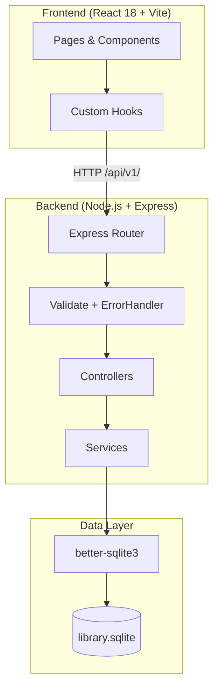
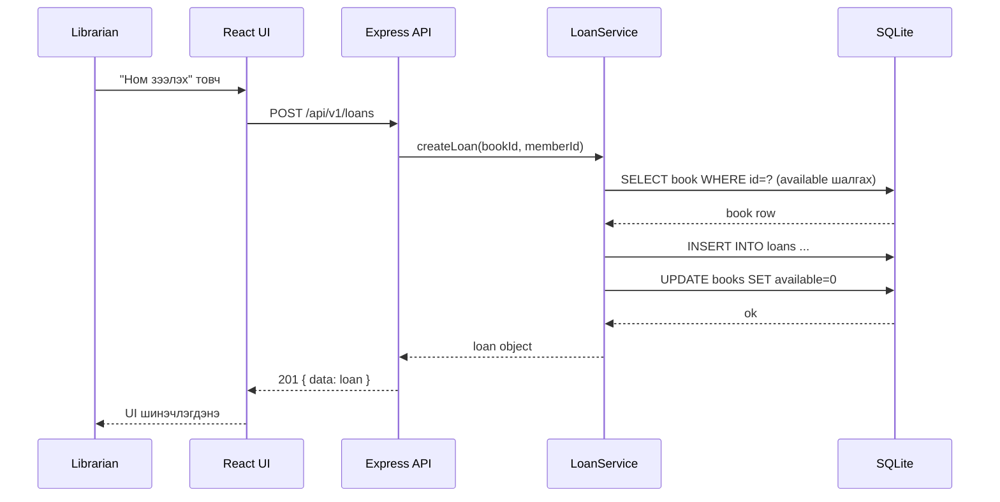
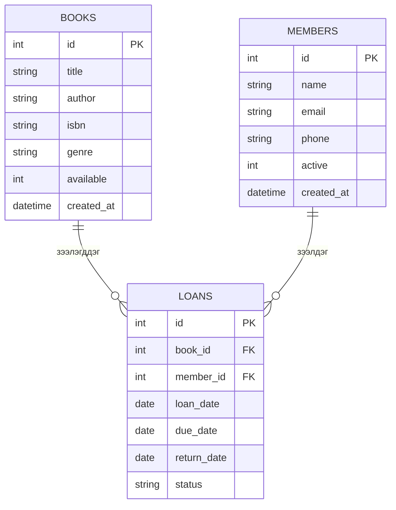

# Architecture — Mini Library System

## System Architecture



## Module Layer Description

| Layer | Файл/Хавтас | Үүрэг |
|-------|-------------|-------|
| Frontend | `client/src/` | UI render, хэрэглэгч interaction |
| Router | `src/routes/` | URL → controller холбоо |
| Controller | `src/controllers/` | req/res format, status code |
| Service | `src/services/` | Business logic, rule шалгалт |
| Middleware | `src/middleware/` | Validation, error handling |
| DB | `src/db/database.js` | Schema, connection, migration |

## Loan Flow Sequence



## Database Schema



## Directory Structure

```
bie-daalt-13/
├── CLAUDE.md
├── README.md
├── .gitignore
├── .claude/commands/
│   ├── review.md
│   ├── test.md
│   ├── docs.md
│   ├── commit.md
│   └── security.md
├── partA/
│   ├── PROJECT.md
│   ├── ARCHITECTURE.md
│   ├── STACK-COMPARISON.md
│   ├── README.md
│   ├── adr/0001-stack-decision.md
│   └── ai-sessions/plan.md
├── partB/
│   ├── src/
│   │   ├── index.js
│   │   ├── routes/
│   │   │   ├── books.js
│   │   │   ├── members.js
│   │   │   └── loans.js
│   │   ├── controllers/
│   │   │   ├── bookController.js
│   │   │   ├── memberController.js
│   │   │   └── loanController.js
│   │   ├── services/
│   │   │   ├── bookService.js
│   │   │   ├── memberService.js
│   │   │   └── loanService.js
│   │   ├── db/database.js
│   │   └── middleware/
│   │       ├── validate.js
│   │       └── errorHandler.js
│   ├── client/src/
│   ├── tests/
│   ├── openapi.yaml
│   └── README.md
└── partC/
    ├── AI-USAGE-REPORT.md
    ├── SELF-EVALUATION.md
    └── adr/0002-*.md
```
